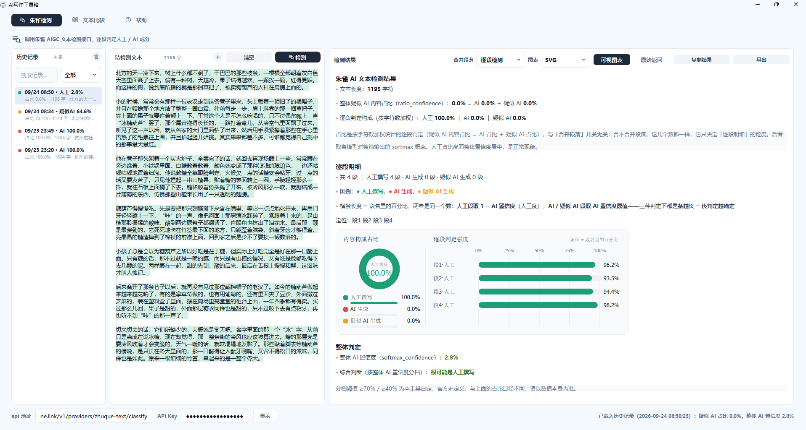

# AI写作工具箱

一个自包含的桌面小工具：把「朱雀 AI 文本检测」与「文本比较」放在同一个窗口下，
三个同级标签页、各自独立运行，可单独打包成 exe 分发。

## 功能说明

- **朱雀检测**：调用朱雀 AIGC 文本检测接口，给出整篇 AI 置信度与逐段判定（人工 / AI / 疑似 AI），
  并在正文上按段铺底色（支持高亮定位与平滑淡出）；
  - 支持导入 / 拖入文本文件（.txt / .md）；
  - 历史记录管理（支持关键词即时搜索、判定档位下拉筛选、置顶 / 删除 / 清空）；
  - 结论复制与导出（Markdown / HTML）；
  - 采用底层套接字物理打断（`CancellationToken`）实现即时取消请求，避免网络请求挂起阻塞；
  - 底部集成动态忙碌进度指示条，检测长耗时状态一目了然。
  - 需要自备 EdgeOne Makers API Key，程序不内置密钥。
- **文本比较**：逐处标记改写文相对原文的新增、删除与修改，结果带颜色；
  - 引擎优化：采用分层预对齐消除多余分词开销，长文本分块引入最长公共子序列（LCS）锚点分治，消除对齐漂移；
  - 交互升级：原文与改写文双栏均支持加号导入与直接拖入文本文件；
  - **双栏等比同步联动滚动**（带复选框控制开关，比对长文更轻松）；
  - 可复制带色文本（粘到 Word、聊天窗口仍保留颜色）；
  - 选项持久化：忽略空白差异、忽略英文大小写、同步滚动状态自动记忆恢复。
- **帮助**：申请朱雀检测 API Key 的图文步骤，控制台链接点击即用系统默认浏览器打开。
- **全局体验与数据可靠性**：
  - 自动记忆并恢复上次关闭时的窗口尺寸、最大化状态与所选标签页；
  - 历史记录与配置采用 SQLite 存储，具备损坏自动检测、备份与自愈重建机制；
  - 清空历史记录时自动执行 `VACUUM` 整理磁盘空间并释放碎片。

不需要注册或登录，解压即用：历史记录与 API Key 只保存在程序自己所在目录的
`data/zhuque_text.db` 里，删掉该文件即清空。

## 界面预览



窗口顶部是三个同级标签页：**朱雀检测**（默认打开） / **文本比较** / **帮助**。

## 目录说明

| 文件 / 目录 | 作用 |
| --- | --- |
| `main.py` | 程序入口：应用初始化（字体/翻译/调色板）、主窗口装配、优雅退出与自检探针开关 |
| `main_window.py` | 主窗口：窗口标题与尺寸、标签栏样式、窗口状态持久化记忆、三个标签页装配与生命周期回调 |
| `compare_tab.py` | 文本比较标签页：界面与交互、后台比对线程、双栏同步滚动、文件拖拽导入、选项记忆与结果复制 |
| `zhuque_tab.py` | 朱雀检测标签页：中枢协调器，组织子面板布局、请求线程管控、动态进度指示条与生命周期协调 |
| `zhuque_editor.py` | 朱雀待检测文本面板：字数统计、文件导入与拖拽过滤、段落底色铺设与微光淡出定位 |
| `zhuque_history.py` | 朱雀历史记录面板：高性能自绘列表（`QStyledItemDelegate`）、微型搜索框与判定档位筛选 |
| `zhuque_result.py` | 朱雀结果面板：结论渲染、SVG 位图转换与注入、可视化与原始返回切换、复制与导出 |
| `help_tab.py` | 帮助标签页：申请 API Key 的图文步骤、可点击的控制台链接 |
| `text_diff.py` | 文本差异引擎：分层预对齐 + 延迟切词 + LCS 分块锚点分治 + 富文本着色输出，纯标准库 |
| `zhuque_text.py` | 朱雀接口调用（带底层 Socket 物理打断）、返回解析、报告 / 图表 / 导出渲染，纯标准库 |
| `zhuque_store.py` | 历史记录与配置的 SQLite 存储层（损坏自愈重建、`VACUUM` 整理、通用配置持久化） |
| `app_paths.py` | 目录解析：程序根目录、只读资源目录（兼容打包后的解包目录）、可写数据目录 |
| `ui_kit.py` | 界面支撑件：主题色、素材加载、公共卡片容器（`CardPanel`）、分段按钮、中文右键菜单、自适应省略标签、提示浮窗 |
| `tests/` | 自动化单元测试套件：覆盖算法、数据解析、SQLite 存储与损坏自愈逻辑 |
| `assets/` | 图标、程序图标、帮助页配图 |
| `docs/` | README 里引用的界面截图 |
| `build_exe.py` | 打包脚本（PyInstaller，一条命令产出单文件 exe） |
| `requirements.txt` | 运行与打包所需的依赖清单 |

三个标签页共用一套界面风格但互不影响：各自持有自己的线程与状态，切过去就能接着用。

## 运行与测试

### 运行环境

```bash
cd zqapi
pip install -r requirements.txt
```

### 启动程序

```bash
python main.py                    # 启动界面（默认打开「朱雀检测」标签页）
python main.py --self-check       # 自检：构建界面、抓取三个标签页截图后退出
python main.py --startup-probe    # 启动探针：按正常路径启动，把窗口状态写成 json 后退出
```

`--startup-probe` 会在程序所在目录生成 `startup-probe.json`（窗口标题 / 是否可见 / 是否最小化 /
尺寸 / 当前标签页）。外部工具查窗口容易被远程会话状态干扰，这个探针让程序自己回答，是验证
"打包后能否正常启动"最可靠的一招。

### 自动化单元测试

```bash
python -m unittest discover -s tests -p "test_*.py"
```

覆盖 15 项核心功能测试，包括：
- `test_text_diff.py`：基础差异比对、空文本、相同文本、前缀/后缀空白差异规范化、长文本分块比对；
- `test_zhuque_text.py`：单段/多段 AI 检测结果解析、Markdown 与 HTML 报告导出、图表计算；
- `test_zhuque_store.py`：历史记录增删改查、置顶、记录清空与 `VACUUM`、数据库损坏自动备份与自愈重建、配置项读写。

数据落在**程序所在目录**下：

- `data/zhuque_text.db` —— 朱雀检测的历史记录与配置（含 API Key，只存本机）
- `self-check/`、`startup-probe.json` —— 上面两个自检开关的输出

## 打包

```bash
python build_exe.py            # 单文件 exe -> dist/ZqApi.exe
python build_exe.py --onedir   # 目录版，启动更快
python build_exe.py --console  # 保留控制台，方便看崩溃信息
```

打包后目录：

```
zqapi/
├─ dist/ZqApi.exe      ← 最终产物（单文件，双击即用）
└─ build/              ← PyInstaller 中间产物，可随时删除
```

验证产物：

```bash
dist/ZqApi.exe --startup-probe   # 输出 dist/startup-probe.json，看 visible / current_tab
dist/ZqApi.exe --self-check      # 输出 dist/self-check/*.png
```

## 下载

不想自己打包的话，到 [Releases](https://github.com/pipabcc/zqapi/releases) 页面下载最新的
`ZqApi.exe`（单文件，双击即用，Release 说明附 SHA-256 校验值与当次更新内容）。

## 界面与交互细节

窗口顶部是三个同级标签页：**朱雀检测 / 文本比较 / 帮助**，**默认停在「朱雀检测」**，
标签按钮的左边缘与页面里那枚图标对齐。

**朱雀检测**

- **左侧历史记录**：
  - 顶部微型搜索框支持实时模糊搜索历史条目；
  - 档位下拉框可按「全部 / 人工 / AI / 疑似 AI」快速过滤；
  - 列表项采用 `QStyledItemDelegate` 自绘，支持右键置顶、删除或一键清空（清空自动整理数据库空间）。
- **中间待检测文本**：
  - 标题行右侧：加号图标（导入 .txt / .md，也支持把文件直接拖进正文）、清空、检测；
  - 检测进行中时，按钮切换为 **取消**，配合底层物理网络打断，秒级响应取消；
  - 底部提供动态忙碌进度指示条，长请求状态更明确；
  - 检测完成后段落铺设底色，点击段落标签可微光高亮平滑淡出定位。
- **右侧检测结果**：
  - 合并段落（逐段检测 / 整篇检测）、图表（SVG / 字符图 / 关闭图表）；
  - 右侧是 可视图表 / 原始返回 切换、复制结果、导出（Markdown / HTML）。
- **底部配置栏**：
  - API 地址、API Key、显示/隐藏按钮，最右侧是状态与耗时（过长会自动省略，悬停看全文）。
  - 点「复制结果」会在窗口中央弹出一个「已复制」浮窗，约 1.5 秒后自动淡出。

**文本比较**

- **双栏编辑器**：
  - 「原文」与「改写文」面板均提供加号导入按钮，且均支持直接拖入 `.txt` / `.md` 文件；
  - 头部提供「交换」、「清空」、「开始比较」主按钮。
- **比对选项与同步滚动**：
  - 提供「忽略空白差异」、「忽略英文大小写」、「同步滚动」三个复选框；
  - 开启「同步滚动」后，原文与改写文/结果区按滚动条比例双向联动，便于对照长文；
  - 所有选项状态自动持久化存储，下次启动依然生效。
- **结果呈现**：
  - 点击开始比较后自动平滑切到「对比结果」；
  - 勾选/取消选项会即时重算，忙碌态延后 200ms 才上屏，毫秒级比对零闪烁；
  - 支持一键「复制结果」，富文本着色带样式，可直接粘贴进 Word 或聊天软件。

**帮助**

- 分步说明怎么申请朱雀检测 API Key：控制台地址（点击用系统默认浏览器打开）、
  在哪点「API Key → 创建 API Key」的截图、以及回到本程序后填到哪个输入框、怎么开始检测。

## 隐私与数据安全

- **数据只在本机**：历史记录、配置与 API Key 都保存在程序自己所在目录的 `data/zhuque_text.db`
  （SQLite），不上传、不联网同步；删掉这个文件即清空。
- **API Key 的存放方式需要知道**：Key 目前**明文**保存在上面的数据库里，方便便携使用；
  请不要把整个程序目录（含 `data/`）发给别人，也不要放进网盘或公开仓库。
  界面上 Key 始终以圆点显示，日志与复制内容里也不会出现完整 Key。
- **检测文本会发送出去**：点「检测」会把待检测文本发送给朱雀检测 API（默认为腾讯云
  EdgeOne Makers 的接口，可在底部自行修改 api 地址）。请勿提交包含个人隐私或敏感信息的内容。
- 主工程的完整隐私约定见 [主工程 PRIVACY.md](https://github.com/pipabcc/deepcat/blob/main/PRIVACY.md)。

## 许可证

本项目继承主工程的 [GPL-3.0](LICENSE) 许可证：可自由使用、修改和分发，
但衍生作品需以相同许可证开源，并保留版权与许可声明。
第三方图标与运行库的分发条件见 [主工程 THIRD_PARTY_LICENSES.md](https://github.com/pipabcc/deepcat/blob/main/THIRD_PARTY_LICENSES.md)。

## 问题反馈

- [GitHub Issues](https://github.com/pipabcc/zqapi/issues)（请附上 `--startup-probe` 的输出与
  系统版本；**不要贴 API Key**，也不要贴含隐私的检测文本）

## 友情链接

- [LINUX DO](https://linux.do)
